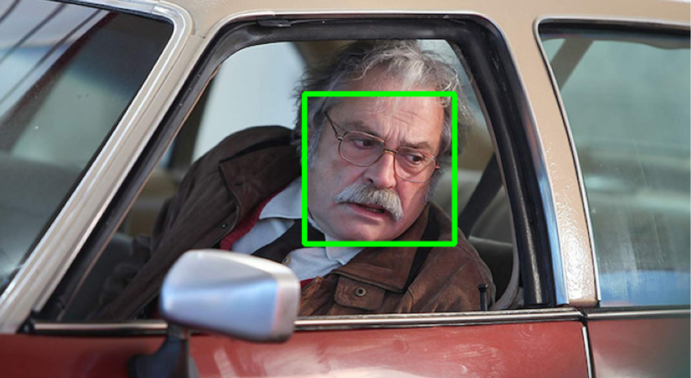

# 🎭 HaarCascade ile Yüz Tanıma Sistemi

Bu proje, OpenCV kütüphanesindeki HaarCascade algoritması kullanılarak 
Türk sinema ve dizi oyuncularının yüzlerini tanıyan bir sistemdir.

## 📌 Proje Hakkında

- HaarCascade ile yüz algılama
- LBPH (Local Binary Patterns Histograms) ile yüz tanıma
- CLAHE ile görüntü ön işleme
- Google Colab ortamında geliştirildi

## 🛠️ Kullanılan Teknolojiler

- Python
- OpenCV
- NumPy
- Google Colab
- Google Drive

## 🚀 Nasıl Çalışır?

1. Oyuncu fotoğrafları Drive'a yüklenir
2. HaarCascade ile yüzler tespit edilir
3. CLAHE ile görüntü iyileştirilir
4. LBPH modeli eğitilir
5. Test görüntüsündeki yüz tanınır

## 📸 Ekran Görüntüleri

### Yüz Algılama

### Yüz Tanıma

## 📁 Klasör Yapısı
FaceProject/
oyuncular/
oyuncu_adi/
1.jpg
2.jpg
test/
test1.jpg

## 👨‍💻 Geliştirici

- Sercan Cintosun
